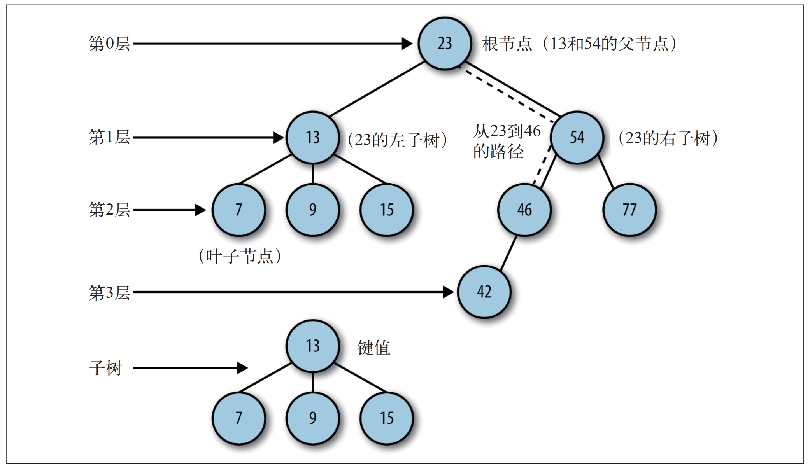
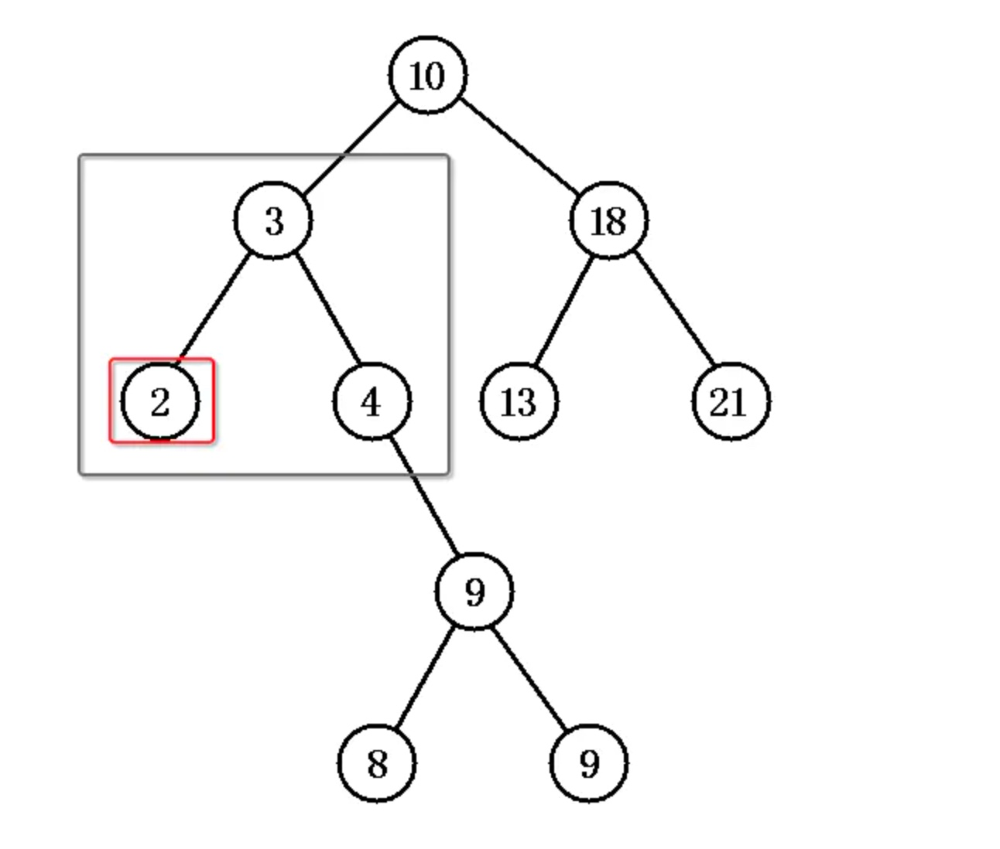
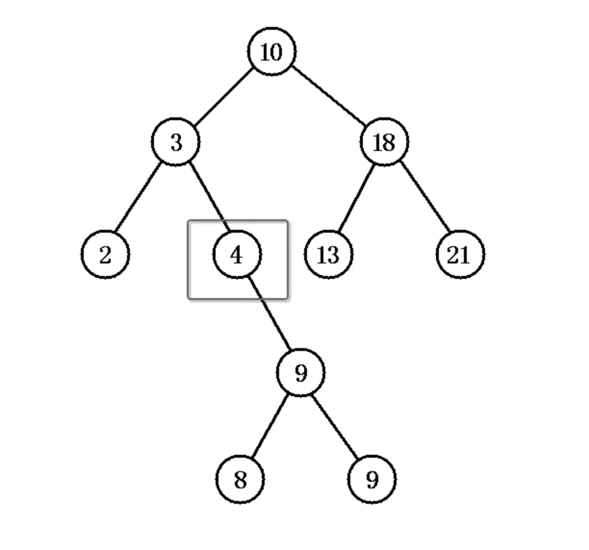
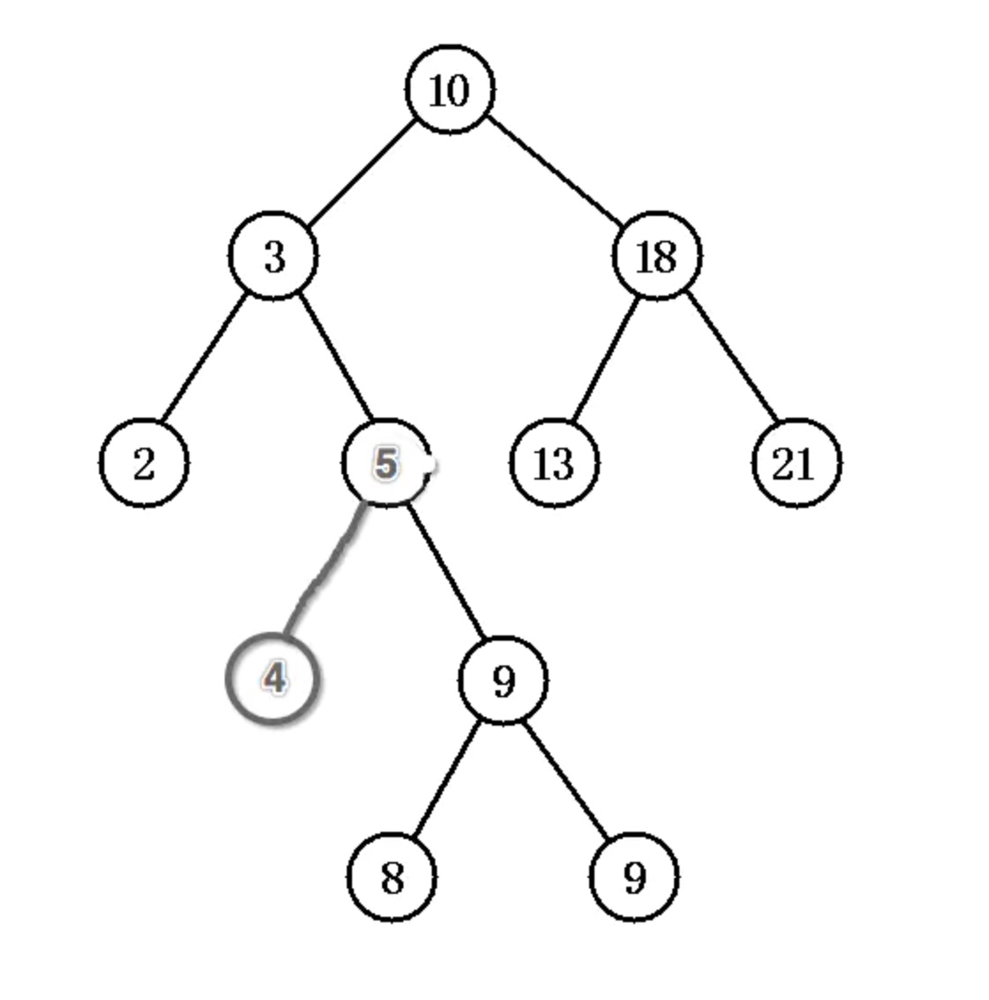
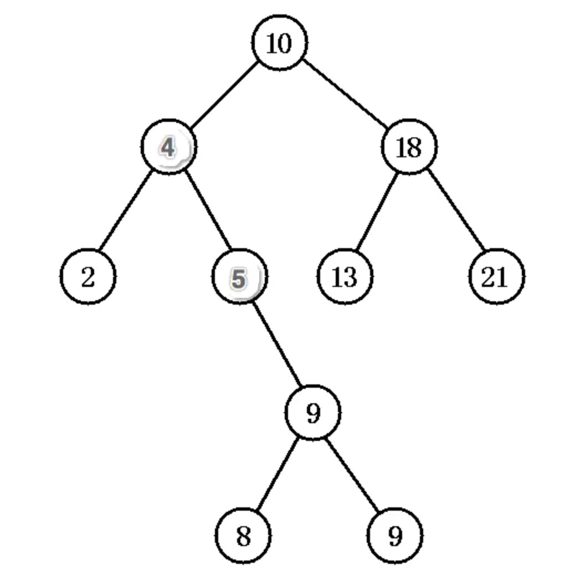
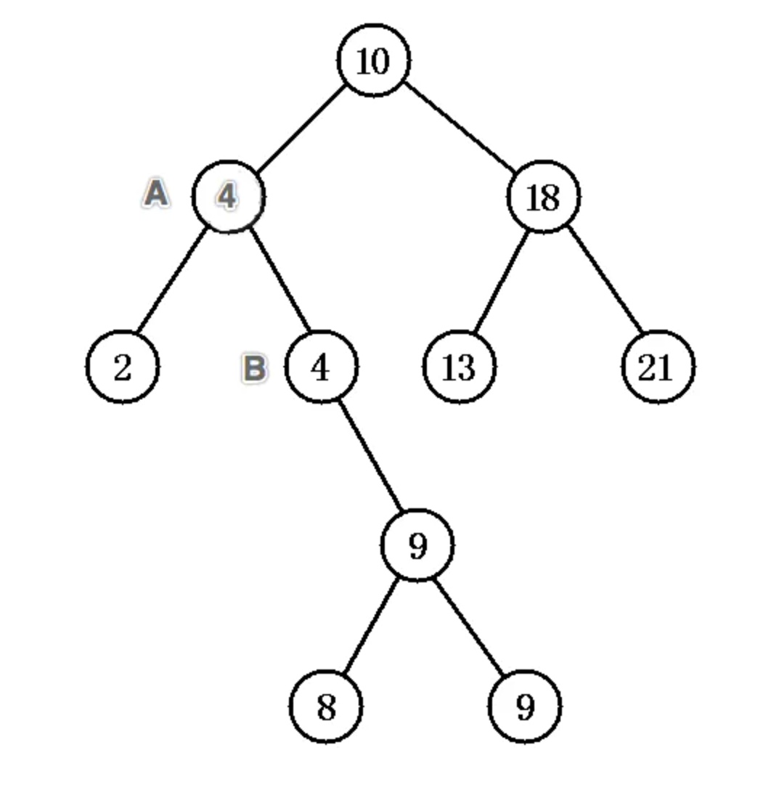
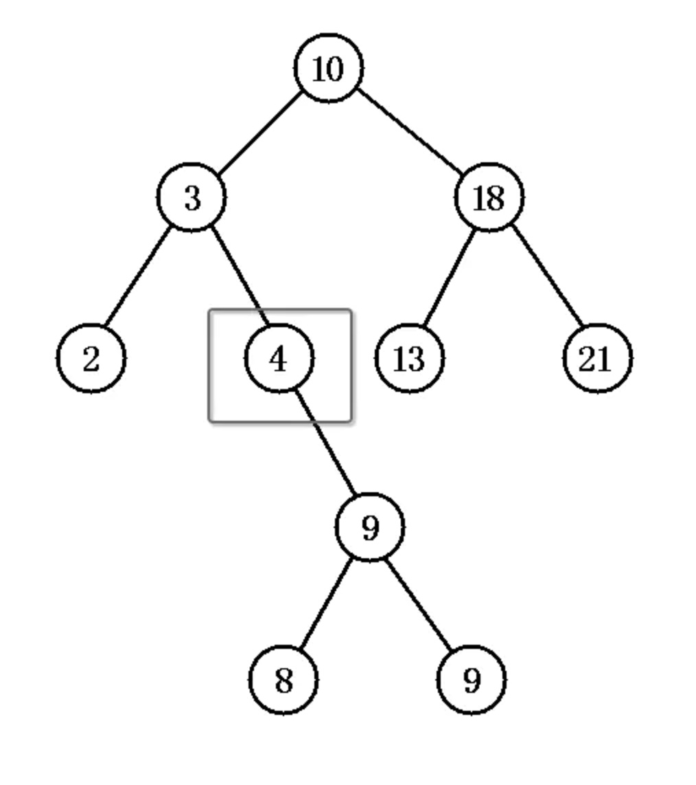
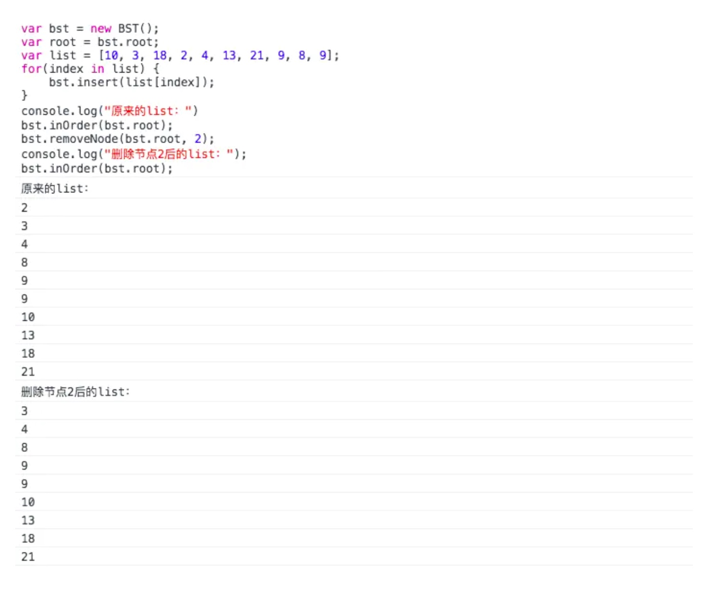
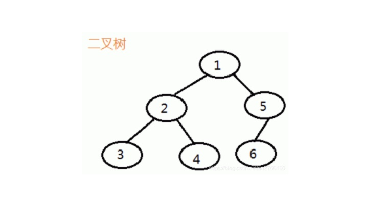
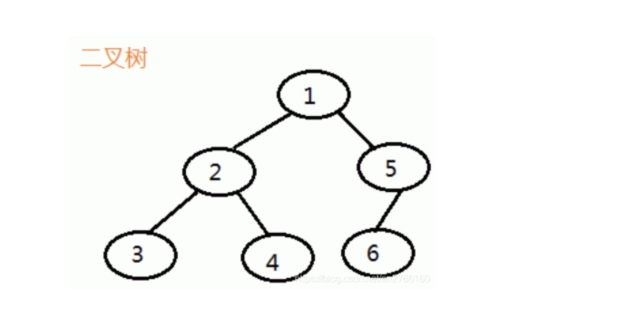

## 二叉树
  树是计算机科学中经常用到的一种数据结构。 树是一种非线性的数据结构， 以分层的方式
存储数据。 树被用来存储具有层级关系的数据， 比如文件系统中的文件； 树还被用来存储
有序列表。 本章将研究一种特殊的树： 二叉树。 选择树而不是那些基本的数据结构， 是因
为在二叉树上进行查找非常快（而在链表上查找则不是这样）， 为二叉树添加或删除元素
也非常快（而对数组执行添加或删除操作则不是这样）


### 树的定义
一棵树最上面的节点称为
根节点， 如果一个节点下面连接多个节点， 那么该节点称为父节点， 它下面的节点称为子
节点。 一个节点可以有 0 个、 1 个或多个子节点。 没有任何子节点的节点称为叶子节点。




二叉树概念

1.除了最下面一层，每个节点都是父节点，每个节点都有且最多有两个子节点；

2.除了嘴上面一层，每个节点是子节点，每个节点都会有一个父节点；

3.最上面一层的节点为根节点；

图例说明：


### 中序遍历概念

先打印左子树（左子节点），接着打印父节点，最后打印右子树（右子节点）

图例说明：


```
<!DOCTYPE html>
<html lang="en">
<head>
    <meta charset="UTF-8">
    <title>Document</title>
</head>
<body>
    <script>
        //创建二叉树
        function Node(data,left,right){
            this.data = data;
            this.left = left;
            this.right = right;
        }
        Node.prototype.show = function(){
            return this.data;
        }
        function BST(){
            this.root = null;
        }
        BST.prototype.insert = function(data){
            var node = new Node(data,null,null);
            if(this.root == null){
                this.root = node;
            }else{
                var current = this.root;
                var parent;
                while(true){
                    parent = current;
                    if(data < current.data){
                        current = current.left;
                        if(current == null){
                            parent.left = node;
                            break;
                        }
                    }else{
                        current = current.right;
                        if(current == null){
                            parent.right = node;
                            break;
                        }
                    }
                }
            }
        }
        //二叉树中序遍历
        BST.prototype.inOrder = function(node){
            if(node){
                this.inOrder(node.left);
                console.log(node.show() + " ");
                this.inOrder(node.right);
            }
        }
        //测试数据
        var bst  = new BST();
        var nums = [10,3,18,2,4,13,21,9,8,9];
        for(var i = 0;i < nums.length;i ++){
            bst.insert(nums[i]);
        }
        bst.inOrder(bst.root);
    </script>
</body>
</html>
```


### 先序遍历概念

先打印父节点，然后是左子节点（左子树），然后再打印右子节点（子树）

图例说明：


 ```
 <!DOCTYPE html>
 <html lang="en">
 <head>
     <meta charset="UTF-8">
     <title>Document</title>
 </head>
 <body>
     <script>
         //创建二叉树
         function Node(data,left,right){
             this.data = data;
             this.left = left;
             this.right = right;
         }
         Node.prototype.show = function(){
             return this.data;
         }
         function BST(){
             this.root = null;
         }
         BST.prototype.insert = function(data){
             var node = new Node(data,null,null);
             if(this.root == null){
                 this.root = node;
             }else{
                 var current = this.root;
                 var parent;
                 while(true){
                     parent = current;
                     if(data < current.data){
                         current = current.left;
                         if(current == null){
                             parent.left = node;
                             break;
                         }
                     }else{
                         current = current.right;
                         if(current == null){
                             parent.right = node;
                             break;
                         }
                     }
                 }
             }
         }
         //二叉树先序遍历
         BST.prototype.perOrder = function(node){
             if(node){
                 console.log(node.show() + " ");
                 this.perOrder(node.left);
                 this.perOrder(node.right);
             }
         }
         //测试数据
         var bst  = new BST();
         var nums = [10,3,18,2,4,13,21,9,8,9];
         for(var i = 0;i < nums.length;i ++){
             bst.insert(nums[i]);
         }
         bst.perOrder(bst.root);
     </script>
 </body>
 </html>
 ```


### 后序遍历概念

首先遍历左子树，然后遍历右子树，最后访问根结点

图例说明：


<!DOCTYPE html>
<html lang="en">
<head>
    <meta charset="UTF-8">
    <title>Document</title>
</head>
<body>
    <script>
        //创建二叉树
        function Node(data,left,right){
            this.data = data;
            this.left = left;
            this.right = right;
        }
        Node.prototype.show = function(){
            return this.data;
        }
        function BST(){
            this.root = null;
        }
        BST.prototype.insert = function(data){
            var node = new Node(data,null,null);
            if(this.root == null){
                this.root = node;
            }else{
                var current = this.root;
                var parent;
                while(true){
                    parent = current;
                    if(data < current.data){
                        current = current.left;
                        if(current == null){
                            parent.left = node;
                            break;
                        }
                    }else{
                        current = current.right;
                        if(current == null){
                            parent.right = node;
                            break;
                        }
                    }
                }
            }
        }
        //二叉树后序遍历
        BST.prototype.postOrder = function(node){
            if(node){
                this.postOrder(node.left);
                this.postOrder(node.right);
                console.log(node.show() + " ");
            }
        }
        //测试数据
        var bst  = new BST();
        var nums = [10,3,18,2,4,13,21,9,8,9];
        for(var i = 0;i < nums.length;i ++){
            bst.insert(nums[i]);
        }
        bst.postOrder(bst.root);
    </script>
</body>
</html>

### 从二叉查找树上删除节点

从 BST 上删除节点的操作最复杂， 其复杂程度取决于删除哪个节点。 如果删除没有子节点
的节点， 那么非常简单。 如果节点只有一个子节点， 不管是左子节点还是右子节点， 就变
得稍微有点复杂了。 删除包含两个子节点的节点最复杂.

为了管理删除操作的复杂度， 我们使用递归操作， 同时定义两个方法： remove() 和
removeNode()。
从 BST 中删除节点的第一步是判断当前节点是否包含待删除的数据， 如果包含， 则删除该
节点； 如果不包含， 则比较当前节点上的数据和待删除的数据。 如果待删除数据小于当前
节点上的数据， 则移至当前节点的左子节点继续比较； 如果删除数据大于当前节点上的数
据， 则移至当前节点的右子节点继续比较。
如果待删除节点是叶子节点（没有子节点的节点）， 那么只需要将从父节点指向它的链接
指向 null。
如果待删除节点只包含一个子节点， 那么原本指向它的节点久得做些调整， 使其指向它的
子节点。
最后， 如果待删除节点包含两个子节点， 正确的做法有两种：<b> 要么查找待删除节点左子树
上的最大值， 要么查找其右子树上的最小值</b>。 这里我们选择后一种方式。
我们需要一个查找子树上最小值的方法， 后面会用它找到的最小值创建一个临时节点。 将
临时节点上的值复制到待删除节点， 然后再删除临时节点。 图 10-7 展示了这一过程。


### 二叉树节点的删除

二叉树节点的删除也是可以分为几种情况:

- 被删除节点为叶子节点；
- 被删除节点仅有一个子节点（子树）；
- 被删除节点有两个子节点（子树）

##### 被删除节点为叶子节点

思路：将该叶子节点的父节点指向的子节点的引用值设为空



以上图为例子，要删除节点 2


```js
console.log(node.data);  // 3
// 删除节点2
node.letf = null;
```

##### 被删除节点仅有一个子树

思路：将该节点的父节点指向该节点的引用改成指向该节点的子节点。




以上图为例子，删除节点4。就是将节点3的node.right 改成 node.right = 节点9

##### 被删除节点有两个子树

思路：处理这种情况有两种方法：

- 从待删除节点的左子树找节点值最大的节点A，替换待删除节点，并删除节点A；
- 从待删除节点的右子树找节点值最小的节点A，替换待删除节点，并删除节点A。

**PS：我们这里选择第二种方法。**
 以下图的二叉树为例，删除节点3。




 按照上面的思路，首先是在节点3的右子树中找节点值最小的节点，我们手动人工智能可以看出节点4就是我们要找的，其实按着二叉树右边小，左边大的特点，就很容易找出来。然后用节点4代替节点5，然后还要删除节点刚找的最小值的节点。最后的结果是：




看到我改了图吧，改一下，让人好点理解嘛，绝不是避开坑专门不说。


 同样是删除节点3，也是用节点4替换，然后就变成了：




 如上面的，要删除原来找到的那个节点值最小的节点B，删除节点B有没有觉得有点眼熟，不就是 **“被删除节点仅有一个子树”** 的情况吗[捂脸]，其实，有没有发现，用节点值为2的节点去替换截止为3的节点更快！


三种情况的解决思路都说完，来看看代码的具体实现：


```js
// 获取给定节点下的二叉树最小值
BST.prototype.getSmallest = function(node) {
    if(node.left == null) {
        return node;
    } else {
        return getSmallest(node.left);
    }
};
// 根据给定删除给定节点下二叉树的对应节点
BST.prototype.removeNode = function(node, data) {
    if(node == null) {
        return null;
    }
    if(data == node.data) {
        // 没有子节点（子树）
        if(node.left == null && node.right == null) {
            return null;
        } 
        // 只有右子节点（子树）
        else if(node.left == null ) {
            return node.right;
        } 
        // 只有左子节点（子树）
        else if(node.right == null){
            return node.left;
        } 
        // 有两个子节点（子树）
        else {
            var tempNode = this.getSmallest(node.right);
            node.data = tempNode.data;
            node.right = this.removeNode(node.right, tempNode.data);
            return node;
        }
    } else if(data < node.data) {
        node.left = this.removeNode(node.left, data);
        return node;
    } else {
        node.right = this.removeNode(node.right, data);
        return node;
    }
}
```

由上面看到这两个方法都是用递归实现的。`removeNode` 递归实现的巧妙之处在于 `return` ，比如说 `node.right = this.removeNode(node.right, data);` 这一句，假设被删除的节点是节点4




 你会发现最后`this.removeNode(node.left, data)`，执行的是下面这段代码：


```js
else if(node.left == null ) {
  return node.right;
} 
```

理一下代码，最后的代码是：`node.right = node.right.right;`，在“不知不觉中”就删除了节点node.right，可以用删除节点4代入一下。node就是节点3，而node.right就是节点4， node.right.right就是节点9。
 最后也是代码测试一下：




#### JavaScript算法-深度优先搜索(DFS)/广度优先搜索(BFS)

##### 深度优先搜索(DFS)

事实上，深度优先搜索属于图算法的一种，英文缩写为DFS即Depth First Search.其过程简要来说是对每一个可能的分支路径深入到不能再深入为止，而且每个节点只能访问一次.

###### 遍历过程

假定现在有个如下图的二叉树,深度优先搜索1开始遍历子节点,然后从左边树纵深遍历,直到元素不存在子节点,然后回溯,继续遍历子节点,直至左边全部便利完成,回溯到根开始遍历右边树节点.最后遍历顺序即:1->2->3->4->5->6.

###### 实现原理

深度优先搜索是基于栈实现的,Stack 先入后出(FILO)

这边我们仅引用栈的api, 结合栈的特性,使用JavaScript语法可用Array来表示栈,结合Array的shift(),unshift()方法.

假设有一个[ ], 我们把1,2,3通过unshift()放入[3, 2, 1], 通过shift()取出为3, 2, 1 ,模拟栈的特性.

图例



如上图二叉树,通过栈来实现深度优先搜索

| 栈      |              进栈 | 出栈  |
| :------ | ----------------: | :---: |
| 1       |             1进栈 | 1出栈 |
| 2, 5    |  1的子节点5,2进栈 | 2出栈 |
| 3, 4, 5 | 2的子节点4,3进栈, | 3出栈 |
| 4, 5    |       3没有子节点 | 4出栈 |
| 5       |       4没有子节点 | 5出栈 |
| 6       |      5子节点6进栈 | 6出栈 |


算法实现

```
//节点构造函数
function Node(key){
    this.children = []  //不确定当前节点子节点数,使用数组表示
    this.key = key    //当前节点序号
}
 
//创建节点
let n1 = new Node(1),
    n2 = new Node(2),
    n3 = new Node(3),
    n4 = new Node(4),
    n5 = new Node(5),
    n6 = new Node(6);
 
//构建数
n1.children.push(n2, n5)
n2.children.push(n3, n4)
n5.children.push(n6)
 
//深度优先搜索算法实现
function dfs(node){
    const stack = [node]  //模拟栈
    while( stack.length > 0){ //栈中存在数据
        const first = stack.shift();  //从头部获取出栈元素
        console.log(first.key)  //打印出出栈元素序号
        first.children.slice().reverse().forEach(  
            child => stack.unshift(child) //从头部插入进栈元素
        )
    }
}
 
dfs(n1)  // 1,2,3,4,5,6
```


##### 广度优先搜索(BFS)

广度优先搜索，其英文全称是Breadth First Search。从算法的观点，所有因为展开节点而得到的子节点都会被加进一个先进先出的队列中。

###### 遍历过程

还以上图二叉树为例,广度优先搜索是对数进行逐层遍历的,先从第一层开始遍历,然后遍历第二层直至没有更多的子节点,顺序可表示为1, 2, 5, 3, 4, 6

###### 实现原理

广度优先搜索是基于队列先进先出（FIFO）的数据结构实现的

JavaScript实现队列,可以通过数组的方法来模拟, 进入队列使用push(), 出列使用shift()

假设有个[], 把1, 2, 3按照队列方式使用, 每次push()后得到[1, 2, 3], 出列使用shift() 得到, 1 -> 2 ->3

图例




还是这个熟悉的图,我们使用队列来分析广度优先搜索

| 队列    |              入队列 | 出队列  |
| :------ | ------------------: | :-----: |
| 1       |           1进入队列 | 1出队列 |
| 2, 5    | 1子节点2, 5进入队列 | 2出队列 |
| 5, 3, 4 | 2子节点3, 4进入队列 | 5出队列 |
| 3, 4, 6 |    5子节点6进入队列 | 3出队列 |
| 4, 6    |         3没有子节点 | 4出队列 |
| 6       |         4没有子节点 | 6出队列 |


 

算法实现

```
//节点构造函数
function Node(key){
    this.children = [] //用数组来存放子节点
    this.key = key //当前节点序号
}
 
//创建节点
let n1 = new Node(1),
    n2 = new Node(2),
    n3 = new Node(3),
    n4 = new Node(4),
    n5 = new Node(5),
    n6 = new Node(6);
 
//构建树
n1.children.push(n2, n5)
n2.children.push(n3, n4)
n5.children.push(n6)
 
//广度优先搜索算法实现
function bfs(node){
    const queue = [node] //创建一个队列
    while(queue.length){ //队列存在元素
        const first = queue.shift() //先出
        console.log(first.key) //出列元素序号
        first.children.forEach(
            child => queue.push(child) //子节点进入队列
        )
    }
}
 
bfs(n1)  //1,2,5,3,4,6
```


###### 递归

其实上述的深度优先搜索的算法运用体现, 就是递归, 递归的原理实现是栈, 它拥有天然的dfs结构.

我们上面运用深度优先搜索实现的算法完全可以用递归来实现,并且更加简洁

```
//节点构造函数
function Node(key){
    this.children = [] //用数组来存放子节点
    this.key = key //当前节点序号
}
 
//创建节点
let n1 = new Node(1),
    n2 = new Node(2),
    n3 = new Node(3),
    n4 = new Node(4),
    n5 = new Node(5),
    n6 = new Node(6);
 
//构建树
n1.children.push(n2, n5)
n2.children.push(n3, n4)
n5.children.push(n6)
 
//利用递归实现dfs
function dfs(node){
    console.log(node.key)
    node.children.forEach(dfs)
}
  
dfs(n1)  // 1,2,3,4,5,6
```

