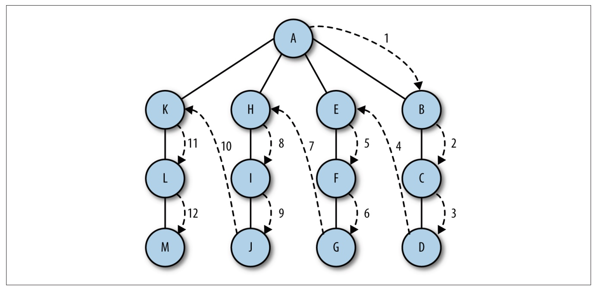

## 图的定义

图由边的集合及顶点的集合组成。 看看美国的州地图， 每两个城镇都由某种道路相连。 地
图， 就是一种图， 上面的每个城镇可以看作一个顶点， 连接城镇的道路便是边。 边由顶点
对 (v1,v2) 定义， v1 和 v2 分别是图中的两个顶点。 顶点也有权重， 也称为成本。 如果一个
图的顶点对是有序的， 则可以称之为有向图。 在对有向图中的顶点对排序后， 便可以在两
个顶点之间绘制一个箭头。 有向图表明了顶点的流向。 计算机程序中用来表明计算方向的
流程图就是一个有向图的例子。 图 11-1 展示了一个有向图

 


如果图是无序的， 则称之为无序图， 或无向图。 图 11-2 展示了一个无序图。


图中的一系列顶点构成路径， 路径中所有的顶点都由边连接。 路径的长度用路径中第一个
顶点到最后一个顶点之间边的数量表示。 由指向自身的顶点组成的路径称为环， 环的长度
为 0。
圈是至少有一条边的路径， 且路径的第一个顶点和最后一个顶点相同。 无论是有向图还是
无向图， 只要是没有重复边或重复顶点的圈， 就是一个简单圈。 除了第一个和最后一个顶
点以外， 路径的其他顶点有重复的圈称为平凡圈。
如果两个顶点之间有路径， 那么这两个顶点就是强连通的， 反之亦然。 如果有向图的所有
的顶点都是强连通的， 那么这个有向图也是强连通的。


### 用图对现实中的系统建模

可以用图对现实中的很多系统建模。 比如对交通流量建模， 顶点可以表示街道的十字路
口， 边可以表示街道。 加权的边可以表示限速或者车道的数量。 建模人员可以用这个系统
来判最佳路线及最有可能堵车的街道。
任何运输系统都可以用图来建模。 比如， 航空公司可以用图来为其飞行系统建模。 将每个
机场看成顶点， 将经过两个顶点的每条航线看作一条边。 加权的边可以表示从一个机场到
另一个机场的航班成本， 或两个机场间的距离， 这取决于建模的对象是什么。
包含局域网和广域网（如互联网） 在内的计算机网络， 同样经常用图来建模。 另一个可以
用图来建模的现实系统是消费市场， 顶点可以用来表示供应商和消费者。

### 图类

乍一看， 图和树或者二叉树很像， 你可能会尝试用树的方式去创建一个图类， 用节点来表
示每个顶点。 但这种情况下， 如果用基于对象的方式去处理就会有问题， 因为图可能增长
到非常大。 用对象来表示图很快就会变得效率低下， 所以我们要考虑表示顶点和边的其他
方案

### 表示顶点

创建图类的第一步就是要创建一个 Vertex 类来保存顶点和边。 这个类的作用与链表和二叉
搜索树的 Node 类一样。 Vertex 类有两个数据成员： 一个用于标识顶点， 另一个是表明这
个顶点是否被访问过的布尔值。 它们分别被命名为 label 和 wasVisited。 这个类只需要一
个函数， 那就是为顶点的数据成员设定值的构造函数。 Vertex 类的代码如下所示：
function Vertex(label) {
       this.label = label;
}
我们将所有顶点保存到数组中， 在图类里， 可以通过它们在数组中的位置引用它们。

### 表示边

图的实际信息都保存在边上面， 因为它们描述了图的结构。 我们很容易像之前提到的那样
用二叉树的方式去表示图， 这是不对的。 二叉树的表现形式相当固定， 一个父节点只能有
两个子节点， 而图的结构却要灵活得多， 一个顶点既可以有一条边， 也可以有多条边与它
相连。
我们将表示图的边的方法称为邻接表或者邻接表数组。 这种方法将边存储为由顶点的相邻

顶点列表构成的数组， 并以此顶点作为索引。 使用这种方案， 当我们在程序中引用一个顶
点时， 可以高效地访问与这个顶点相连的所有顶点的列表。 比如， 如果顶点 2 与顶点 0、
1、 3、 4 相连， 并且它存储在数组中索引为 2 的位置， 那么， 访问这个元素， 我们可以访
问到索引为 2 的位置处由顶点 0、 1、 3、 4 组成的数组。 本章将选用这种表示方法， 参见
示意图 11-3


邻接表
另一种表示图边的方法被称为邻接矩阵。 它是一个二维数组， 其中的元素表示两个顶
点之间是否有一条边

### 构建图

确定了如何在代码中表示图之后， 构建一个表示图的类就很容易了。 下面是第一个 Graph
类的定义：

```
function Graph(v) {
   this.vertices = v;
   this.edges = 0;
   this.adj = [];
 for (var i = 0; I < this.vertices; ++i) {
   this.adj[i] = [];
   this.adj[i].push("");
 } 
   this.addEdge = addEdge;
   this.toString = toString;
}
```

这个类会记录一个图表示了多少条边， 并使用一个长度与图的顶点数相同的数组来记录顶点的数量。 通过 for 循环为数组中的每个元素添加一个子数组来存储所有的相邻顶点， 并将所有元素初始化为空字符串  addEdge() 函数定义如下：

```
function addEdge(v, w) {
    this.ajd[v].push(w);
    this.adj[w].push(v);
    this.edges++;
}
```

当调用这个函数并传入顶点 A 和 B 时， 函数会先查找顶点 A 的邻接表， 将顶点 B 添加到列
表中， 然后再查找顶点 B 的邻接表， 将顶点 A 加入列表。 最后， 这个函数会将边数加 1。

showGraph() 函数会通过打印所有顶点及其相邻顶点列表的方式来显示图

```
function showGraph() {
    for (var i = 0; i < this.vertices; ++i) {
      putstr(i + "->");
      for (var j = 0; j < this.vertices; ++j) {
         if (this.adj[i][j] != undefined)
           putstr(this.adj[i][j] + ' ');
       } 
      print();
   }
}
```

例 11-1 展示了一个 Graph 类的完整定义

#### Graph 类

```
// 定点表示
function Vertex(label) {
  this.label = label;
}

// 构建图
function Graph(v) {
  this.vertices = v;
  this.edges = 0;
  this.adj = [];
  for (var i = 0; i < this.vertices; i++) {
    this.adj[i] = [];
    // this.adj[i].push("");
  }
}
//展示了一个 Graph 类的完整定义
Graph.prototype = {
    // 添加数据
  addEdge(v, w) {
    this.adj[v].push(w);
    this.adj[w].push(v);
    this.edges++;
  },
  // 显示数据
  showGraph() {
    for (var i = 0; i < this.vertices; i++) {
      console.log(i + "->");
      for (var j = 0; j < this.vertices; j++) {
        if (this.adj[i][j] != undefined) {
          console.log(this.adj[i][j] + " ");
        }
      }
    }
  },
  toString() {},
};

function dfs(v) {
  this.marked[v] = true;
  if (this.adj[v] != undefined) {
    console.log("Visited vertex: " + v);
  }
  for (var w in this.adj[v]) {
    if (!this.marked[w]) {
      this.dfs(w);
    }
  }
}
var g = new Graph(5);
g.addEdge(0, 1);
g.addEdge(0, 2);
g.addEdge(1, 3);
g.addEdge(2, 4);
g.showGraph();

```

#### 搜索图

确定从一个指定的顶点可以到达其他哪些顶点， 这是经常对图执行的操作。 我们可能想通
过地图了解到从一个城镇到另一个城镇有哪些路， 或者从一个机场到其他机场有哪些航班。
图上的这些操作是用搜索算法执行的。 在图上可以执行两种基础搜索： 深度优先搜索和广
度优先搜索。 本节将仔细研究这两种算法。

#### 深度优先搜索

深度优先搜索包括从一条路径的起始顶点开始追溯， 直到到达最后一个顶点， 然后回溯，
继续追溯下一条路径， 直到到达最后的顶点， 如此往复， 直到没有路径为止。 这不是在搜
索特定的路径， 而是通过搜索来查看在图中有哪些路径可以选择。 图 11-4 演示了深度优先搜索的搜索过程



深度优先搜索算法比较简单： 访问一个没有访问过的顶点， 将它标记为已访问， 再递归地
去访问在初始顶点的邻接表中其他没有访问过的顶点。
要让该算法运行， 需要为 Graph 类添加一个数组， 用来存储已访问过的顶点， 将它所有元
素的值全部初始化为 false。 Graph 类的代码片段演示了这个新数组及其初始化过程， 如下
所示

```
this.marked = [];
for (var i = 0; i < this.vertices; ++i ) {
     this.marked[i] = false;
}
```

现在我们可以开始编写深度优先搜索函数：

```
function dfs(v) {
 this.marked[v] = true;
// 用于输出的 if 语句在这里不是必须的
if (this.adj[v] != undefined){
   print("Visited vertex: " + v);
}
 
 for each(var w in this.adj[v]) {
    if (!this.marked[w]) {
     this.dfs(w);
    }
  }
}
```

深度优先搜索代码

```
/*
 * @Author: your name
 * @Date: 2021-10-20 14:10:53
 * @LastEditTime: 2021-10-20 17:33:26
 * @LastEditors: Please set LastEditors
 * @Description: In User Settings Edit
 * @FilePath: /algorithm/javascript/图和图算法/01.js
 */
// 定点表示
function Vertex(label) {
  this.label = label;
}

// 构建图
function Graph(v) {
  this.vertices = v;
  this.edges = 0;
  this.adj = [];

  for (var i = 0; i < this.vertices; i++) {
    this.adj[i] = [];
    // this.adj[i].push("");
  }
  this.marked = [];
  for (var i = 0; i < this.vertices; ++i) {
    this.marked[i] = false;
  }
}
//展示了一个 Graph 类的完整定义
Graph.prototype = {
  // 添加数据
  addEdge(v, w) {
    this.adj[v].push(w);
    this.adj[w].push(v);
    this.edges++;
  },
  // 显示数据
  showGraph() {
    for (var i = 0; i < this.vertices; i++) {
      console.log(i + "->");
      for (var j = 0; j < this.vertices; j++) {
        if (this.adj[i][j] != undefined) {
          console.log(this.adj[i][j] + " ");
        }
      }
    }
  },
  toString() {},
  // 递归深度优先搜索
  dfs(v) {
    this.marked[v] = true;
    // 用于输出的 if 语句在这里不是必须的
    if (this.adj[v] != undefined) {
      console.log("Visited vertex: " + v);
      for (var w of this.adj[v]) {
        if (!this.marked[w]) {
          this.dfs(w);
        }
      }
    }
 
  },
};

var g = new Graph(5);
g.addEdge(0, 1);
g.addEdge(0, 2);
g.addEdge(1, 3);
g.addEdge(2, 4);
g.showGraph();
g.dfs(0);

```


#### 广度优先搜索

广度优先搜索从第一个顶点开始， 尝试访问尽可能靠近它的顶点。 本质上， 这种搜索在图
上是逐层移动的， 首先检查最靠近第一个顶点的层， 再逐渐向下移动到离起始顶点最远的
层。 图 11-5 演示了广度优先搜索的搜索过程。


广度优先搜索算法使用了抽象的队列而不是数组来对已访问过的顶点进行排序。 其算法的
工作原理如下：

(1) 查找与当前顶点相邻的未访问顶点， 将其添加到已访问顶点列表及队列中；
(2) 从图中取出下一个顶点 v， 添加到已访问的顶点列表；
(3) 将所有与 v 相邻的未访问顶点添加到队列。

以下是广度优先搜索函数的定义：

```
function bfs(s) {
  var queue = [];
  this.marked[s] = true;
  queue.push(s); // 添加到队尾
  while (queue.length > 0) {
 		 var v = queue.shift(); // 从队首移除
      if (v == undefined) {
           print("Visisted vertex: " + v);
      } 
        for each(var w in this.adj[v]) {
              if (!this.marked[w]) {
                  this.edgeTo[w] = v;
                  this.marked[w] = true;
                  queue.push(w);
              }
        }
  }
}
```

广度优先搜索函数的测试程序如例 11-3 所示。

