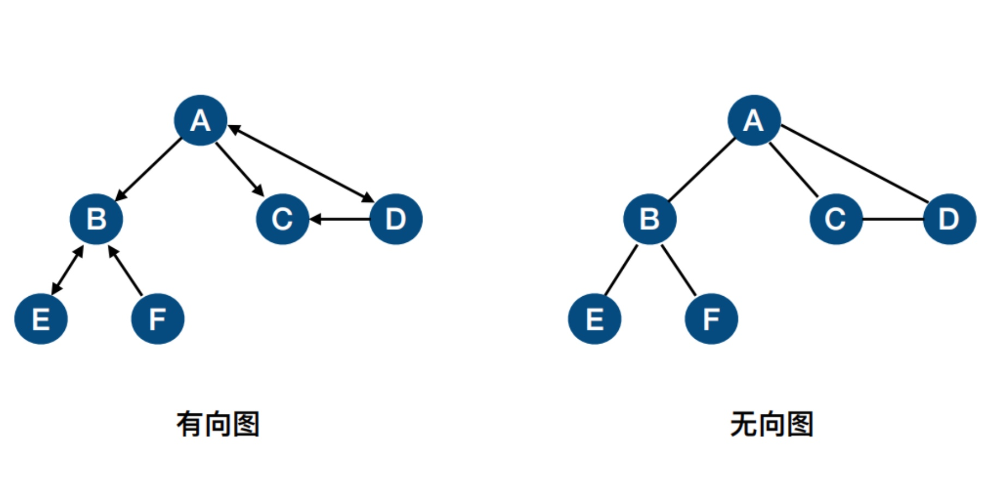
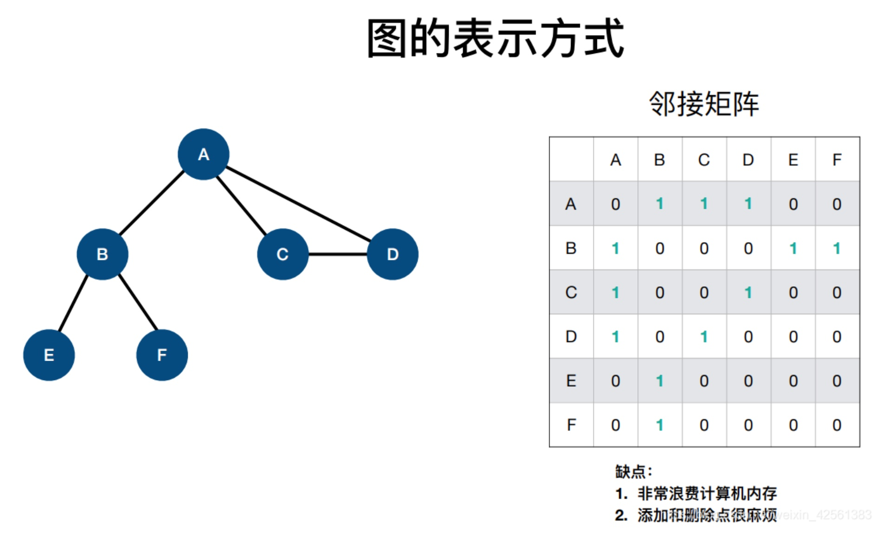

# JavaScript数据结构——图（Graph）

### 概念和结构

- 图是由**顶点**和连接顶点的**边**构成的，通常将数据元素称为顶点，顶点之间的关系称为边。
- 图分为两种，一种是有向图，另一种是无向图。



* 图常用的表示方法有两种，一种是**邻接矩阵**，另一种是**邻接表**。因为邻接矩阵会占用更多的内存，而且进行添加和删除操作会很麻烦，所以这里我们实现邻接表。




### 我们这里实现**无向图**。

- 无向图有六种常用操作，分别为
  1. 添加顶点 addVertex（v）
  2. 添加边 addEdge（a，b）
  3. 打印邻接表 print（）
  4. 广度优先遍历 bfs（v，callback）
  5. 获取最短路径 shortestPath(from，to)
  6. 深度优先遍历 dfs(v，callback)

### JS实现无向图

JS里面的树结构需要通过**对象**（object）和**数组**（array）来实现，其中，对象用来存放边，数组用来存放顶点。

```
var Graph = function(){
    //存储顶点
    var vertexes = [];
    //存储边
    var edges = {};

    //添加顶点
    this.addVertex = function(v){
        if(!vertexes.includes(v)){
            vertexes.push(v);
            edges[v] = [];
        }
    }

    //添加边
    this.addEdge = function(a, b){
        if(vertexes.includes(a) && vertexes.includes(b)){
            if(!edges[a].includes(b)){
                edges[a].push(b);
                edges[b].push(a);
            }
        }
    }

    //打印邻接表
    this.print = function(){
        vertexes.forEach(element => {
            var s = element + " => ";
            edges[element].forEach(element2 => {
                s += element2;
            });
            console.log(s);
        });
    }

    //广度优先遍历
    //用颜色标记状态 white -> 未探索  grey -> 已发现  black -> 已探索
    this.bfs = function(v , callback){
        //初始化颜色
        var color = initColor();
        //创建队列
        var queue = new Queue();
        queue.enqueue(v);

        while(!queue.isEmpty()){
            //正在遍历的顶点now
            var now = queue.dequeue();
            //遍历now相连的每个顶点
            edges[now].forEach(element => {
                if(color[element] === 'white'){
                    queue.enqueue(element);
                    color[element] = 'grey';
                }
            });
            color[now] = 'black';
            if(callback){
                callback(now);
            }
        }
    }
    //广度优先遍历需要用到的函数，将每个顶点颜色初始化为white
    function initColor(){
        var color = {};
        vertexes.forEach(element => {
            color[element] = 'white';
        });
        return color;
    }
    //广度优先遍历需要用到的队列
    function Queue(){
        var queue = [];
        //入队
        this.enqueue = function(element){
            queue.push(element);
        }
        //出队
        this.dequeue = function(){
            return queue.shift();
        }
        //检查队头元素
        this.front = function(){
            return queue[0];
        }
        //检查队列是否为空
        this.isEmpty = function(){
            return queue.length === 0;
        }
        //获取队列长度
        this.size = function(){
            return queue.length;
        }
        //检查队列
        this.getQueue = function(){
            return queue;
        }
    }

    //获取最短路径
    this.shortestPath = function(from , to){
        //路径栈，从to不断寻找回溯点，在寻找过程中推进栈，最后后进先出拿出来
        var path = new Stack(),
        //包含 pre 回溯点 和 d 距离 的对象obj
        obj = this.BFS(from);
        while(to !== from){
            path.push(to);
            to = obj.pre[to];
        }
        path.push(to);

        var s = path.pop();
        while(!path.isEmpty()){
            s += ' => ';
            s += path.pop();
        }
        return s;
    }
    //获取最短路径需要用到的栈
    function Stack(){
        var stack = [];
        //入栈
        this.push = function(element){
            stack.push(element);
        }
        //出栈
        this.pop = function(){
            return stack.pop();
        }
        //检查栈顶元素
        this.peek = function(){
            return stack[stack.length - 1];
        }
        //检查栈是否为空
        this.isEmpty = function(){
            return stack.length === 0;
        }
        //清空栈
        this.clear = function(){
            stack = [];
        }
        //获取栈长度
        this.size = function(){
            return stack.length;
        }
        //检查栈
        this.getStack = function(){
            return stack;
        }
    }
    //获取最短路径需要用到的改良的广度优先算法
    //回溯点 pre
    //距离   d
    this.BFS = function(v , callback){
        //初始化颜色
        var color = initColor();
        //创建队列
        var queue = new Queue();
        queue.enqueue(v);

        var d = {},
        pre = {};
        //初始化d和pre
        vertexes.forEach(element => {
            d[element] = 0;
            pre[element] = null;
        });

        while(!queue.isEmpty()){
            //正在遍历的顶点now
            var now = queue.dequeue();
            //遍历now相连的每个顶点
            edges[now].forEach(element => {
                if(color[element] === 'white'){
                    queue.enqueue(element);
                    color[element] = 'grey';

                    pre[element] = now;
                    d[element] = d[now] + 1;
                }
            });
            color[now] = 'black';
            if(callback){
                callback(now);
            }
        }
        return {
            pre: pre,
            d: d
        };
    }

    //深度优先遍历
    this.dfs = function(v , callback){
        var color = initColor();
        dfsFun(v , color , callback);
    }
    //深度优先遍历需要用到的遍历函数
    function dfsFun(v , color , callback){
        color[v] = 'grey';
        edges[v].forEach(element => {
            if(color[element] === 'white'){
                dfsFun(element , color , callback);
            }
        });
        color[v] = 'black';
        if(callback){
            callback(v);
        }
    }
}

```
