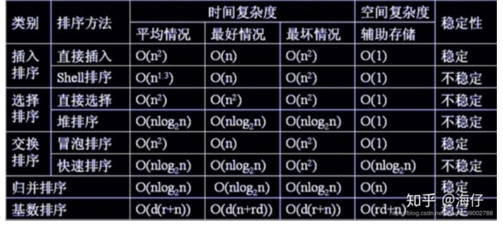
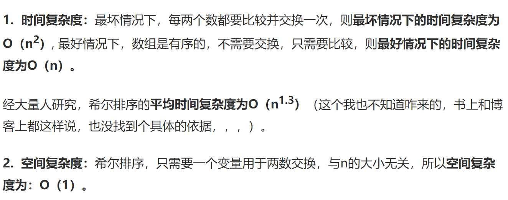

[https://blog.csdn.net/weixin_50886514/article/details/119045154?ops_request_misc=%257B%2522request%255Fid%2522%253A%2522165682038316782248518117%2522%252C%2522scm%2522%253A%252220140713.130102334..%2522%257D&request_id=165682038316782248518117&biz_id=0&utm_medium=distribute.pc_search_result.none-task-blog-2~all~top_positive~default-1-119045154-null-null.142^v30^control,185^v2^control&utm_term=%E6%8F%92%E5%85%A5%E6%8E%92%E5%BA%8F&spm=1018.2226.3001.4187](https://blog.csdn.net/weixin_50886514/article/details/119045154?ops_request_misc=%7B%22request%5Fid%22%3A%22165682038316782248518117%22%2C%22scm%22%3A%2220140713.130102334..%22%7D&request_id=165682038316782248518117&biz_id=0&utm_medium=distribute.pc_search_result.none-task-blog-2~all~top_positive~default-1-119045154-null-null.142^v30^control,185^v2^control&utm_term=插入排序&spm=1018.2226.3001.4187)


 冒泡排序，选择排序，插入排序，希尔排序，快速排序，归并排序，桶排序。


排序总结


# 复杂度

## 说明

- 时间复杂度指的是一个算法执行所耗费的时间
- 空间复杂度指运行完一个程序所需内存的大小
- 稳定指，如果a=b,a在b的前面，排序后a仍然在b的前面
- 不稳定指，如果a=b，a在b的前面，排序后可能会交换位置
- 各种排序的稳定性，时间复杂度、空间复杂度、稳定性总结如下图：



关于时间复杂度：
	(1)平方阶(O(n2))排序
	各类简单排序:直接插入、直接选择和冒泡排序；
	(2)线性对数阶(O(nlog2n))排序
	　　快速排序、堆排序和归并排序；
	(3)O(n1+§))排序,§是介于0和1之间的常数。
	希尔排序
	(4)线性阶(O(n))排序
	基数排序，此外还有桶、箱排序。

	关于稳定性：
	稳定的排序算法：冒泡排序、插入排序、归并排序和基数排序
	不是稳定的排序算法：选择排序、快速排序、希尔排序、堆排序	
## 稳定排序和不稳定排序

稳定排序和不稳定排序
1.如何区分？
2.稳定性意义的探讨
1.如何区分？
稳定排序：排序前后两个相等的数相对位置不变，则算法稳定
非稳定排序：排序前后两个相等的数相对位置发生了变化，则算法不稳定

2.稳定性意义的探讨
1、如果只是简单的进行数字的排序，那么稳定性将毫无意义。

2、如果排序的内容仅仅是一个复杂对象的某一个数字属性，那么稳定性依旧将毫无意义（所谓的交换操作的开销已经算在算法的开销内了，如果嫌弃这种开销，不如换算法好了？）

3、如果要排序的内容是一个复杂对象的多个数字属性，但是其原本的初始顺序毫无意义，那么稳定性依旧将毫无意义。

4、除非要排序的内容是一个复杂对象的多个数字属性，且其原本的初始顺序存在意义，那么我们需要在二次排序的基础上保持原有排序的意义，才需要使用到稳定性的算法，例如要排序的内容是一组原本按照价格高低排序的对象，如今需要按照销量高低排序，使用稳定性算法，可以使得想同销量的对象依旧保持着价格高低的排序展现，只有销量不同的才会重新排序。（当然，如果需求不需要保持初始的排序意义，那么使用稳定性算法依旧将毫无意义）


# 排序算法

对计算机存储的数据执行的两种常见的操作是排序和检索，自从计算机产业伊始便是如此，这也意味着排序和检索在计算机科学中是被研究的最多的操作。

数组测试平台类

```
/*
 * @Author: your name
 * @Date: 2021-11-04 11:54:20
 * @LastEditTime: 2021-11-04 14:20:53
 * @LastEditors: Please set LastEditors
 * @Description: In User Settings Edit
 * @FilePath: /algorithm/javascript/排序算法/01.js
 */
function CArray(numElements) {
  this.dataStore = [];
  this.pos = 0;
  this.numElements = numElements;
  for (var i = 0; i < numElements; i++) {
    this.dataStore[i] = i;
  }
}

CArray.prototype = {
  // 设置数据
  setData() {
    for (var i = 0; i < this.numElements; ++i) {
        //生成100内的随机数
      this.dataStore[i] = Math.floor(Math.random() * (this.numElements + 1));
    }
  },
  // 清除数据
  clear() {
    for (var i = 0; i < this.dataStore.length; i++) {
      this.dataStore[i] = i;
    }
  },
  // 插入数据
  insert(element) {
    this.dataStore[this.pos++] = element;
  },
  toString() {
    var retstr = "";
    for (var i = 0; i < this.dataStore.length; i++) {
      retstr += this.dataStore[i] + " ";
      if (i > 0 && i % 10 == 0) {  //10个数就换行
        retstr += "\n";
      }
    }
    return retstr;
  },
  // 对换
  swap(arr, index1, index2) {
    var temp = arr[index1];
    arr[index1] = arr[index2];
    arr[index2] = temp;
  },
};

var numElements = 100;
var myNums = new CArray(numElements);
myNums.setData();
console.log(myNums.toString());

```


 setData() 随机生成数字

  toString() 10个就换行打印输出

## 冒泡排序

冒泡算法它是最慢的算法之一，但也是一种最容易实现的排序算法

#### **时间复杂度**

* 基本思想：对相邻的元素进行两两比较，顺序相反则交换。
  冒泡排序的平均时间复杂度为 O(n²) ，
* 最坏时间复杂度为 O(n²) ，最好的时间复杂度是O(n)，空间复杂度为 O(1) ，是稳定排序。

#### **空间复杂度**

开辟一个空间交换顺序`O(1)`

*  之所以叫冒泡排序是因为使用这种排序算法排序时， 数据值会像气泡一样从数组的一端漂
  浮到另一端。 假设正在将一组数字按照升序排列， 较大的值会浮动到数组的右侧， 而较小
  的值则会浮动到数组的左侧。  相邻两元素之间两两比较，比较出大值进行赋值互换，

* 相邻元素两两对比，元素交换，大的元素交换到后面。 下一次就不需要比较刚才那个大的值了

* 稳定性
  稳定，因为if判断不成立，就不会交换顺序，不会交换相同元素

  冒泡排序它在所有排序算法中最简单。然而， 从运行时间的角度来看，冒泡排序是最差的一个，它的复杂度是O(n2)。
  冒泡排序比较任何两个相邻的项，如果第一个比第二个大，则交换它们。元素项向上移动至正确的顺序，就好像气泡升至表面一样，冒泡排序因此得名。
  交换时，我们用一个中间值来存储某一交换项的值。

* 算法是for两层

* 假如数据结构是   [8, 94, 15, 88, 55, 76, 21, 39]

  * 第一层比较
    * 第一次8和94比较，把94放到最后，
    * 第二次94和15比较，把94放在后面，
    * 第三次94和88比较把94放到后面，以此类推
  * 第二层比较找出第二个的大值，但是不会再和94比较了
    * 重复上面的执行

* 排序如图


源码

```
function bubbleSort(arr) {
  console.time("冒泡排序耗时");
  var len = arr.length;
  for (var i = 0; i < len - 1; i++) {
    for (var j = 0; j < len - 1 - i; j++) {
      // 相邻元素两两对比，元素交换，大的元素交换到后面
      // 下一次就不需要比较刚才那个大的值了
      if (arr[j] > arr[j + 1]) {
        var temp = arr[j];
        arr[j] = arr[j + 1];
        arr[j + 1] = temp;
      }
    }
  }
  console.timeEnd("冒泡排序耗时");
  return arr;
}
```


## 选择排序

#### JS选择排序

#### 原理

首先从原始数组中找到最小的元素，并把该元素放在数组的最前面，然后再从剩下的元素中寻找最小的元素，放在之前最小元素的后面，直到排序完毕。

#### 时间复杂度，空间复杂度，稳定性

- 平均时间复杂度O(n*n)
- 最好情况O(n*n)
- 最差情况O(n*n)
- 空间复杂度O(1)
- 稳定性：不稳定

选择排序和冒泡选择有些相似，也是用两层for但是不同之处是冒泡是相邻的两个值比较，而选择排序是一个元素每次跑一趟和所有其他元素比较，得到最大或者最小值，放在前面或者后面。然后第二趟元素再跟剩余所有元素比较。下图解释了选择排序


源码

```
//二，选择排序，先定义一个元素的最大值与最小值，拿 每个元素与最值比较，取大值放到元素最右端，层 层比较，#互换元素下标位置，再赋值，所以比冒泡排序的效率高，
 
function selectSort(arr) {
  console.time("选择排序耗时");
  var len = arr.length;
  var minIndex, temp;
  for (i = 0; i < len - 1; i++) {
    minIndex = i; // 存储索引
    for (let j = i + 1; j < len; j++) {
      if (arr[j] < arr[minIndex]) {
        minIndex = j; // 替换索引
      }
    }
    temp = arr[i];
    arr[i] = arr[minIndex]; // 交互顺序
    arr[minIndex] = temp;
  }
  console.timeEnd("选择排序耗时");
  return arr;
}


// 也可以这样写 从小到大
function selectSort(arr) {
  console.time("选择排序耗时");
  var len = arr.length;
  var temp;
  for (i = 0; i < len - 1; i++) {
    temp = arr[i];  //存储最小值
    for (let j = i + 1; j < len; j++) {
      if (arr[j] < temp) { //如果arr[j]比temp小 则互换位置
        arr[i] = arr[j];  // 交互顺序
        arr[j] = temp;
        temp = arr[i]; // 存储最小值
        // console.log(arr);
      }
    }
  }
  console.timeEnd("选择排序耗时");
  return arr;
}


```


## 插入排序

　插入排序（Insertion-Sort）的算法描述是一种简单直观的排序算法。它的工作原理是通过构建有序序列，对于未排序数据，在已排序序列中从后向前扫描，找到相应位置并插入。

## 算法描述：

一般来说，插入排序都采用 in-place 在数组上实现：

- 从第一个元素开始，该元素可以认为已经被排序；

- 取出下一个元素，在已经排序的元素序列中从后向前扫描；

- 如果该元素（已排序）大于新元素，将该元素移到下一位置；

- 重复步骤3，直到找到已排序的元素小于或者等于新元素的位置；

- 将新元素插入到该位置后；

- 重复步骤2~5。

  动图演示：


理一下大体思路：

1.默认从 i = 1 开始判断，这样 preIndex 自然是内部循环的游标；

2.current 保存 arr[i]，通过循环来确定 current 的最终位置；

3.每个内循环开始的时候，arr[i] === current === arr[preIndex + 1]，所以在内循环首次时 arr[preIndex + 1] = arr[preIndex] 的时候不必担心 arr[i] 的值丢失；

4.总体思路是，需要排位的元素先额外缓存起来，然后套用内循环，使得需要调整的元素赋值给它后面的一个位置上，形成依次挪位，最后因为内循环在判断条件不生效的时候停止意味着找到了需要排位的元素的正确位置，然后赋值上去，完成排序。

 

## 算法分析：

　　插入排序在实现上，通常采用in-place排序（即只需用到O(1)的额外空间的排序），因而在从后向前扫描过程中，需要反复把已排序元素逐步向后挪位，为最新元素提供插入空间。


# [js归并排序](https://www.cnblogs.com/ming1025/p/13864754.html)

归并排序是建立在归并操作上的一种有效的排序算法。该算法是采用分治法（Divide and Conquer）的一个非常典型的应用。将已有序的子序列合并，得到完全有序的序列；即先使每个子序列有序，再使子序列段间有序。若将两个有序表合并成一个有序表，称为2-路归并。 

- 把长度为n的输入序列分成两个长度为n/2的子序列；
- 对这两个子序列分别采用归并排序；
- 将两个排序好的子序列合并成一个最终的排序序列。


代码实现

```
var array = randomArray(1,100); //创建1-100的不重复的随机数组
console.log(array);
var len = array.length;
sort(0,len);
console.log(array);
function sort(begin,end) {
    if (end - begin < 2) {
        return;
    }
    let mid = (begin + end) >> 1;
    sort(begin, mid);
    sort(mid, end);
    merge(begin,mid,end);
}
function merge(begin,mid,end) {
    let li = 0,le = mid - begin;
    let ri = mid,re = end;
    let ai = begin;
    let leftArray = [];
    for (let i = li;i<le;i++) {
        leftArray[i] = array[begin + i];
    }
    while(li < le){
        if(ri < re && array[ri] < leftArray[li]){
            array[ai++] = array[ri++];
        }else{
            array[ai++] = leftArray[li++];
        }
    }
}
```


# 希尔排序

希尔排序是把记录按下标的一定增量分组，对每组使用直接插入排序算法排序；随着增量逐渐减少，每组包含的关键词越来越多，当增量减至1时，整个文件恰被分成一组，算法便终止。

简单插入排序很循规蹈矩，不管数组分布是怎么样的，依然一步一步的对元素进行比较，移动，插入，比如[5,4,3,2,1,0]这种倒序序列，数组末端的0要回到首位置很是费劲，比较和移动元素均需n-1次。

　　而希尔排序在数组中采用跳跃式分组的策略，通过某个增量将数组元素划分为若干组，然后分组进行插入排序，随后逐步缩小增量，继续按组进行插入排序操作，直至增量为1。希尔排序通过这种策略使得整个数组在初始阶段达到从宏观上看基本有序，小的基本在前，大的基本在后。然后缩小增量，到增量为1时，其实多数情况下只需微调即可，不会涉及过多的数据移动。


　　来看下希尔排序的基本步骤，在此选择增量gap=length/2，缩小增量继续以gap = gap/2的方式，这种增量选择可以用一个序列来表示，{n/2,(n/2)/2...1}，称为增量序列。希尔排序的增量序列的选择与证明是个数学难题，选择的这个增量序列是比较常用的，也是希尔建议的增量，称为希尔增量，但其实这个增量序列不是最优的。此处做示例使用希尔增量。


三、复杂度分析

