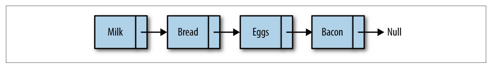
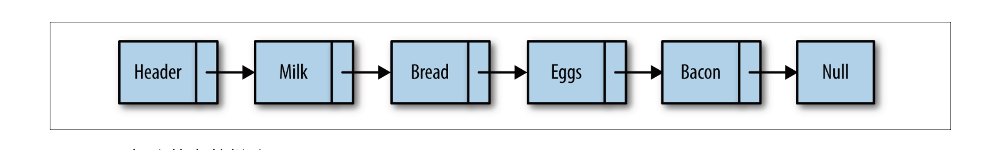

## 数组的缺点

数组不总是组织数据的最佳数据结构， 原因如下。 在很多编程语言中， 数组的长度是固定
的， 所以当数组已被数据填满时， 再要加入新的元素就会非常困难。 在数组中， 添加和删
除元素也很麻烦， 因为需要将数组中的其他元素向前或向后平移， 以反映数组刚刚进行了
添加或删除操作。 然而， JavaScript 的数组并不存在上述问题， 因为使用 split() 方法不需
要再访问数组中的其他元素了。
JavaScript 中数组的主要问题是， 它们被实现成了对象， 与其他语言（ 比如 C++ 和 Java）
的数组相比， 效率很低（请参考 Crockford 那本书的第 6 章）。
如果你发现数组在实际使用时很慢， 就可以考虑使用链表来替代它。 除了对数据的随机访
问， 链表几乎可以用在任何可以使用一维数组的情况中。 如果需要随机访问，

